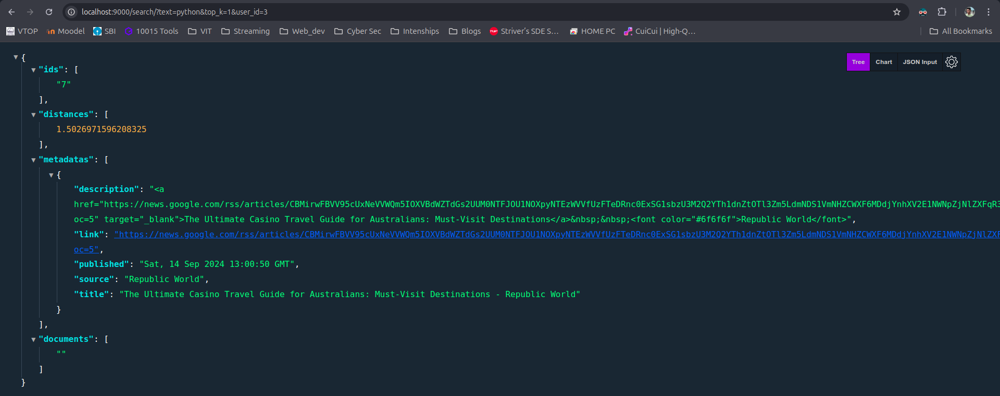
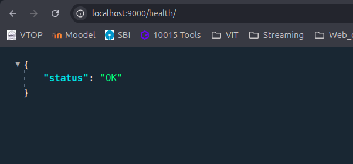

# Document Retrieval
        - By Aaditya Nagarajan

## Description

A django backend for a document retrieval system. The system is designed to retrieve documents based on a query. The documents are stored in a database and the system uses a vector space model to retrieve the documents. The system uses the cosine similarity

## Screen Shots




## Features

### Document Retrieval System

1. **API Design**
   - **/health**: Endpoint to check the API's status. Returns a simple response to ensure the API is active.
   - **/search**: Endpoint to retrieve a list of top results based on the client's query. It accepts parameters:
     - `text`: The prompt text (default is 'business').
     - `top_k`: The number of results to fetch (default is 10).
     - `threshold`: The similarity score threshold for filtering results (default is no threshold).
   - Includes robust request/response handling with validation and structured error responses.
   - Implements rate limiting and user tracking to manage API usage.

2. **Database Interaction**
   - Efficient schema design for storing document metadata and embeddings.
   - Utilizes PostgreSQL with pgvector for storing and querying document embeddings.
   - Implements background tasks for scraping and updating news articles in the database.

3. **Concurrency**
   - Uses background workers to scrape news articles and update the database without blocking main operations.
   - Leverages threading or async features for efficient handling of concurrent tasks.

4. **Caching and Optimization**
   - Employs Redis for caching search results to improve retrieval performance.
   - Caches query results for a default of 5 minutes, with cache invalidation and timing tracking.
   - Implements rate limiting to prevent abuse and manage user request frequency.

5. **Error Handling and Logging**
   - Includes structured logging for API requests and responses.
   - Handles edge cases such as missing or invalid user IDs and query parameters.
   - Provides detailed error messages and HTTP status codes to facilitate debugging and user feedback.

6. **Dockerization**
   - The application is Dockerized for ease of deployment and consistent environments.
   - Configured to run the backend and Redis in separate containers, ensuring scalability and isolation.

7. **User Request Management**
   - Tracks user API requests and increments the count with each request.
   - Creates new entries for users who make their first request.
   - Implements a rate limit to prevent users from making more than 5 requests within a 5-minute window, with appropriate HTTP 429 responses for excessive requests.

8. **Inference Time Tracking**
   - Records and includes inference time in API responses, allowing users to view API speed and performance.


## Available API Endpoints

### 1. **GET /health**

- **Description**: Checks if the API is active.
- **Method**: `GET`
- **Response**:
  ```json
  {
    "status": "OK"
  }

### 2. **GET /search**

- **Description**: Retrieves a list of top results based on the client's query.
- **Query Parameters:**

    - **user_id (required):** The ID of the user making the request. Must be an integer.
    - **text (optional):** The prompt text for the search. Default is "business".
    - **top_k (optional):** Number of results to fetch. Default is 10.
    - **threshold (optional):** Similarity score threshold for filtering results. Default is no threshold.
    - 
- **Response**:
- ```json
  {
    "ids": ["0"],
    "distances": [1.8157421859684468],
    "metadatas": [
      {
        "description": "ANRF can help India counter China\u2019s influence, boost tech diplomacy",
        "link": "https://news.google.com/rss/articles/CBMipAFBVV95cUxQb2NHQUFQdUF2LUFwMURPa0lrY",
        "published": "Sun, 15 Sep 2024 04:00:32 GMT",
        "source": "ThePrint",
        "title": "ANRF can help India counter China\u2019s influence, boost tech diplomacy - ThePrint"
      }
    ],
    "documents": [
      "India\u2019s scientific prowess dates back centuries, from the innovations of Aryabhata and the mathematical brilliance of Bhaskaracharya to the modern breakthroughs of CV Raman and Satyendra Nath Bose. However, the establishment of the ANRF is more than just an extension of that legacy; it\u2..."
    ]
  }
    ```

## Technologies Used

- **Django**: Web framework for building the backend API.
- **Django REST Framework**: Toolkit for building Web APIs using Django.
- **Sqlite3**: Lightweight database for development.
- **Redis**: In-memory data structure store for caching.
- **Celery**: Distributed task queue for background processing.
- **Docker**: Containerization platform for packaging the application.
- **CromaDB**: Vector Database for storing document embeddings.

## Installation

1. Clone the repository:
   ```bash
   git clone
    cd document-retrieval
    ```
2. Create a virtual environment:
3. Install the dependencies:
   ```bash
   pip install -r requirements.txt
   ```
4. Run the Django migrations:
   ```bash
    python manage.py migrate
    ```
5. Start the Django development server:
6. Run the Celery worker:
   ```bash
   celery -A document_retrieval worker --loglevel=info
   ```
7. Run cromaDB server:
   ```bash
    chroma run --path ./docrepo
    ```
8. Start the Redis server:
9. Run the Django development server:
   ```bash
    python manage.py runserver 9000
    ```
10. The API will be available at `http://localhost:9000`.

## Usage

1. Check the API status:
   ```bash
   curl http://localhost:9000/health
   ```

2. Search for documents:
   ```bash
    curl http://localhost:9000/search?user_id=1&text=business&top_k=10&threshold=0.5
    ```
3. The API will return a list of document IDs, distances, metadata, and document text based on the search query.
4. The search results will be cached for 5 minutes to improve retrieval performance.
5. The API will track user requests and limit the number of requests to 5 per 5-minute window.
6. The API will log detailed information about each request and response for debugging and monitoring.
7. The API will record inference time and include it in the response for performance tracking.
8. The API will run background tasks to scrape news articles and update the database without blocking main operations.
9. The API will use Redis for caching search results and managing user request frequency.
10. The API will use cromaDB for storing document embeddings and querying documents based on similarity.
11. The API will use Celery for distributed task processing and background worker management.
12. The API will use Docker for containerization and deployment, ensuring consistent environments and scalability.

